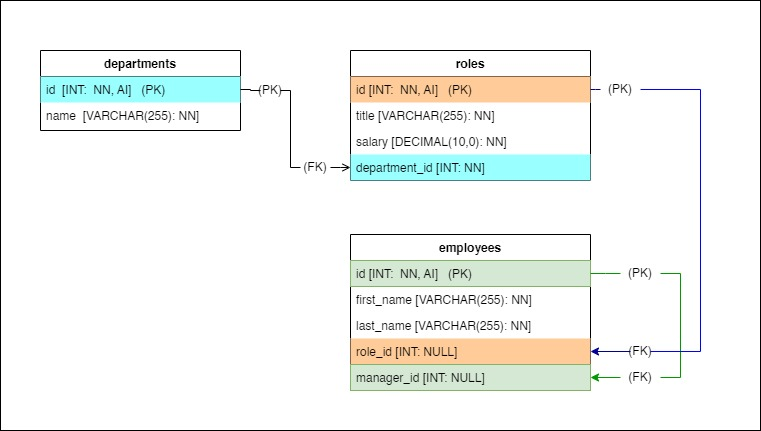

```
  _____                 _                         _____               _                  _                
 | ____|_ __ ___  _ __ | | ___  _   _  ___  ___  |_   _| __ __ _  ___| | _____ _ __     / \   _ __  _ __  
 |  _| | '_ ` _ \| '_ \| |/ _ \| | | |/ _ \/ _ \   | || '__/ _` |/ __| |/ / _ \ '__|   / _ \ | '_ \| '_ \ 
 | |___| | | | | | |_) | | (_) | |_| |  __/  __/   | || | | (_| | (__|   <  __/ |     / ___ \| |_) | |_) |
 |_____|_| |_| |_| .__/|_|\___/ \__, |\___|\___|   |_||_|  \__,_|\___|_|\_\___|_|    /_/   \_\ .__/| .__/ 
                 |_|            |___/                                                        |_|   |_|    
``` 

# CLI : Employee Tracker App
    

## Description
**A command-line application to get access to the company's database using Nodejs and connects the data from MySQL, which you can able to view the details of departments, roles, and employees and also add roles/dept/employee.**

The app was able to connect to the database and update the terminal using an asynchronous function. Using MySQL queries to SELECT the data from tables, JOIN the fields coming from different tables and INSERT the data entered from the CLI. 

[Walkthrough Video](https://vimeo.com/747280321)

## User Story 
 As a business owner, I need an app where I will be able to view and manage the departments, roles, and employees in the company. So That I can organize and plan the business.

## Application
- npm packages (inquirer, mysql2, easy-table, dotenv)
- run Node.js in CLI
- MySQL to create new schema & tables

## Table of Contents
1. [ERD](#erd)
2. [Demo](#demo)
3. [Github Link](#github-link)
4. [Feedback or Contribute](#feedback-or-contribute)
5. [License](#license)
6. [Reference](#reference)


## ERD
```
Entity Relationship Diagram for employee tracker app, using SQL relationship.
```



## Demo
* **Employee Tracker App : CLI**


* **Employee Tracker App : MySQL**


## Github Link
[Profile Link:](https://github.com/maytiara)  

## Feedback or Contribute
***If you have any feedback or suggestion feel free to send an email,*** codingowl898@gmail.com

## License
All rights reserved. Under the MIT license.

## Reference
[License Badge](https://shields.io/), instructor ***Sam*** for some guided syntax code, [ASCII-Text](https://www.coolgenerator.com/ascii-text-generator), [Diagram](draw.io)